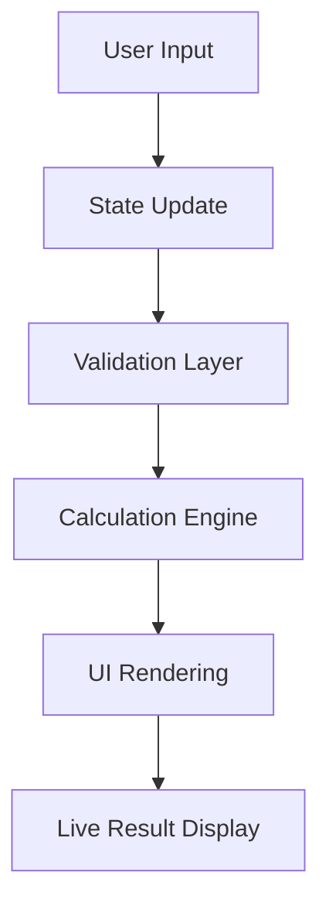
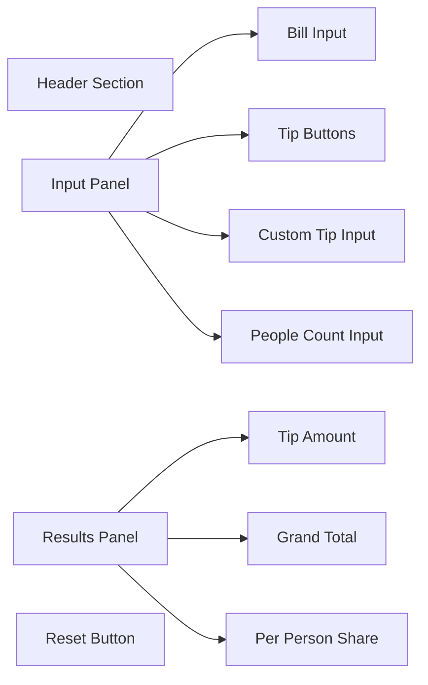
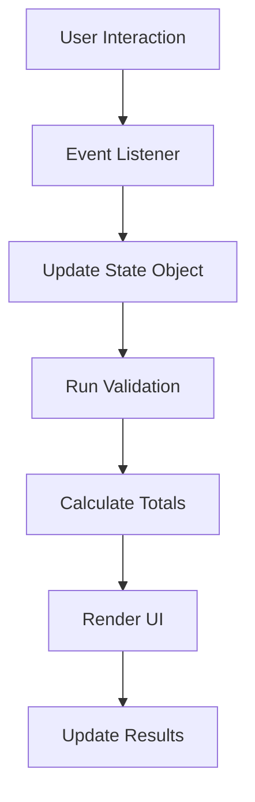
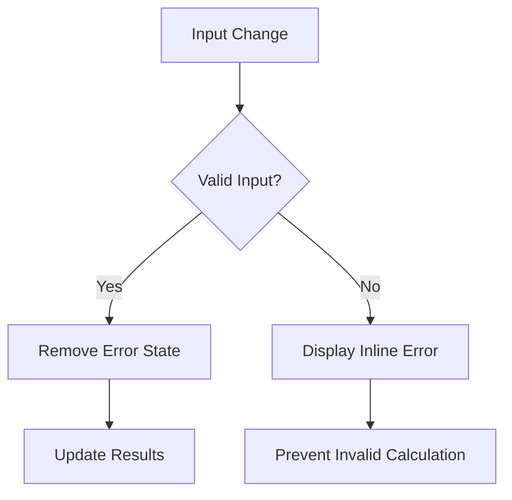
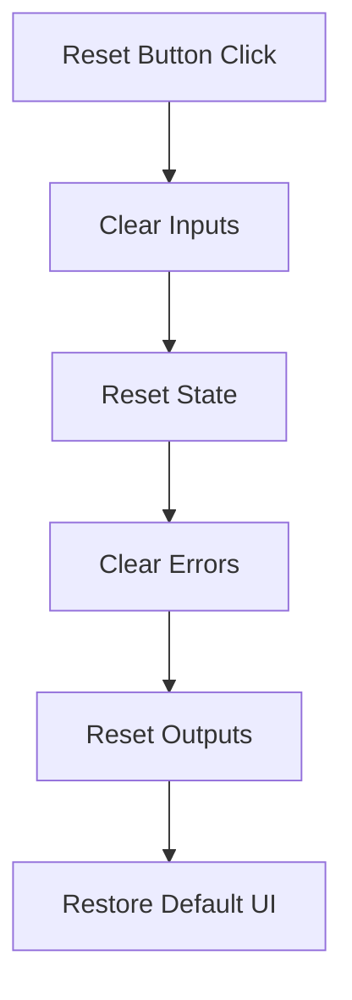
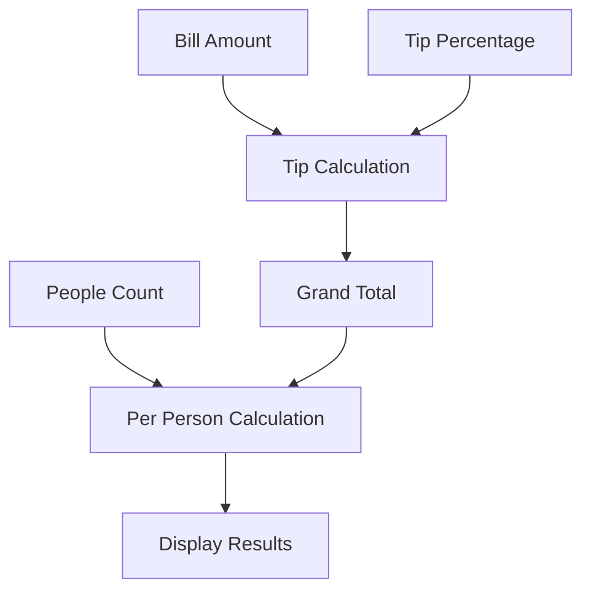

# SplitWise Pro — Architecture Documentation

# System Architecture Overview

The application follows a lightweight frontend-only architecture using:

- HTML for structure
- CSS for presentation
- Vanilla JavaScript for state and interaction logic

---

# High-Level Architecture



---

# Component Architecture



---

# State Management Flow



---

# Validation Flow



---

# Reset Flow



---

# Calculation Flow



---

# Folder Architecture

```txt
splitwise-pro-tip-calculator/
│
├── index.html
├── styles.css
├── script.js
│
├── README.md
├── ANSWERS.md
│
├── docs/
│   ├── idea.md
│   ├── planning.md
│   ├── context.md
│   ├── architecture.md
│   ├── userflows.md
│   └── design.md
│
├── assets/
│
└── .gitignore
```

---

# Design Principles

The architecture prioritizes:

- simplicity
- maintainability
- responsiveness
- accessibility
- interaction quality
- deployment readiness

---

# Future Scalability Considerations

The current structure can later scale into:

- component-based architecture
- API integration
- persistent storage
- authentication system
- framework migration if needed
