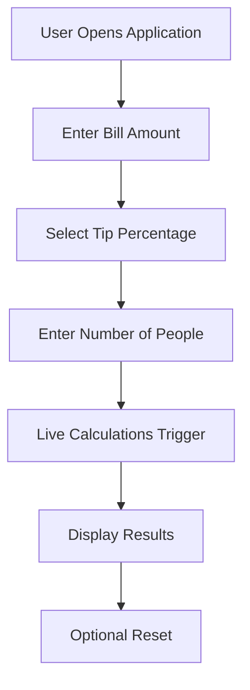
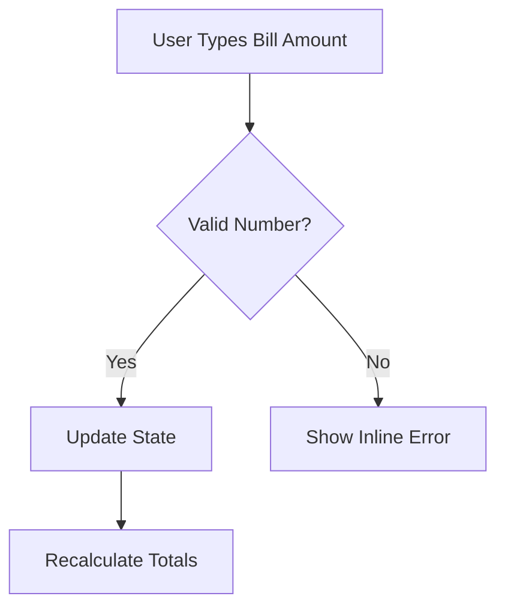
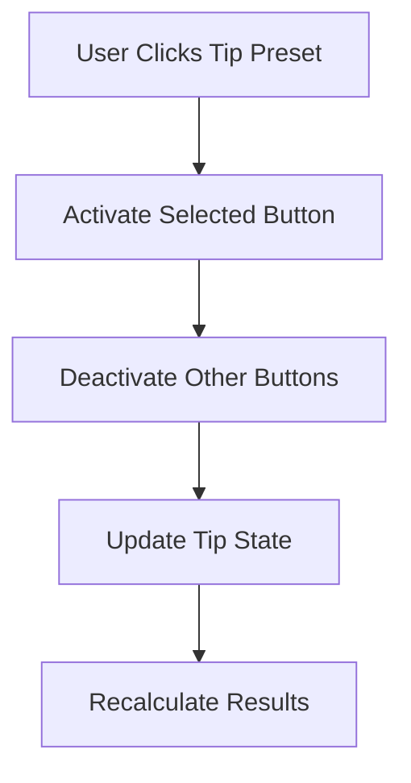
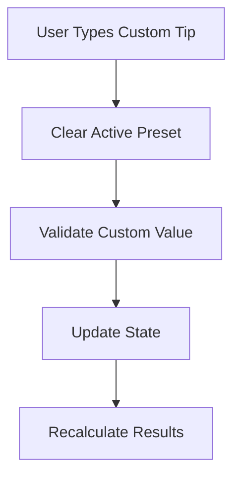
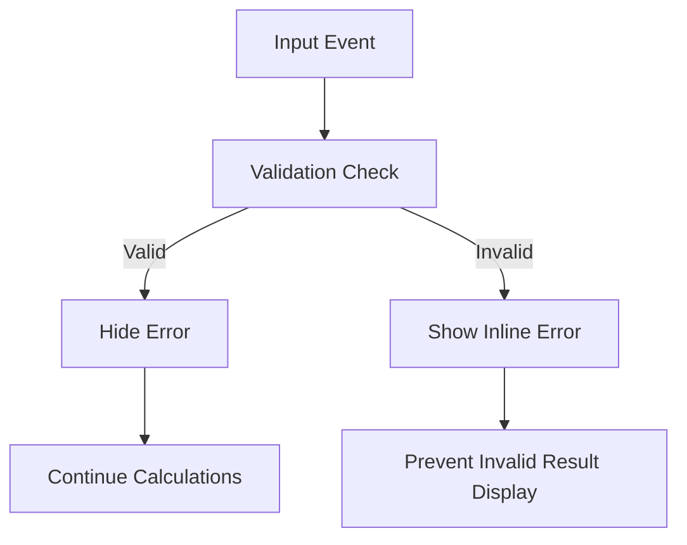
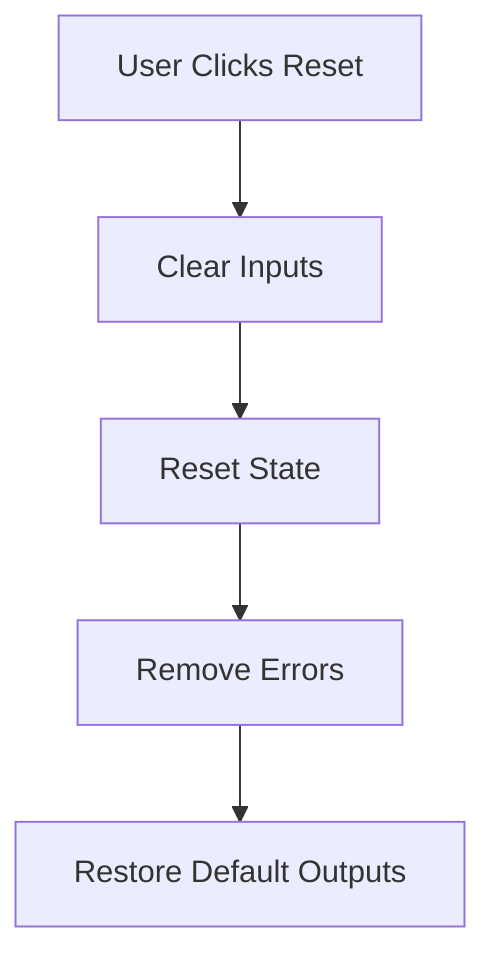
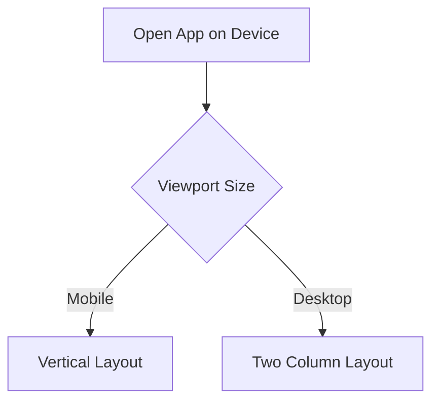
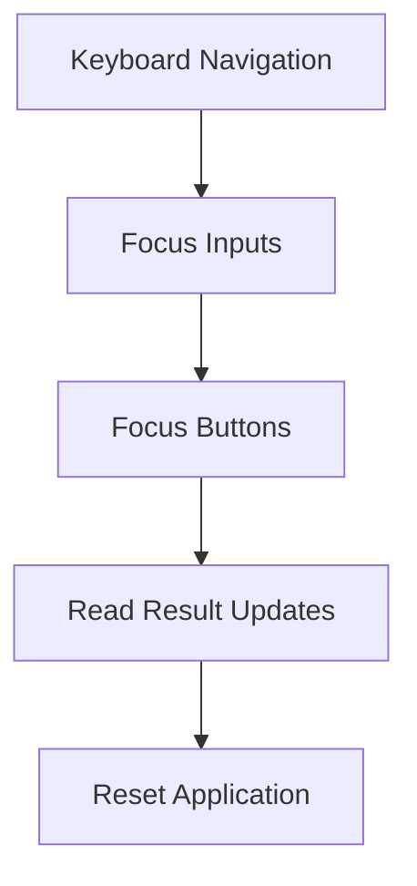

# SplitWise Pro — User Flow Documentation

# User Interaction Philosophy

The application is designed around:

- real-time responsiveness
- smooth interaction flow
- minimal friction
- clear feedback
- stable validation behavior

---

# Primary User Flow

---

# Bill Input Flow

---

# Tip Selection Flow

---

# Custom Tip Flow

---

# Validation Interaction Flow

---

# Reset Interaction Flow

---

# Responsive User Flow

---

# Accessibility User Flow

---

# UX Design Priorities

The user experience prioritizes:

- predictable interactions
- visual clarity
- smooth feedback
- accessibility
- mobile usability
- stable layout behavior
